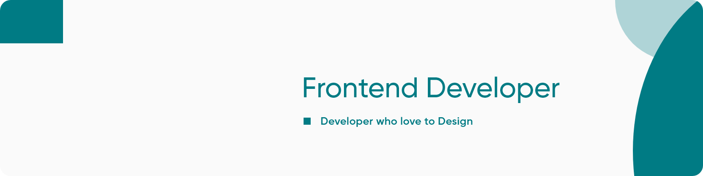

# 👋 Hi I'm Karan Kumar

 
A Frontend Developer working as a freelancer, Blogger and Content Creator. I specialize in working with MERN stacks and love to share my knowledge with other developers, who also want to start their journey as a web developer.  

# Skills

##### [Languages]()

##### [Libraries & Frameworks]()

##### [Tools]()

 

# Connect with me

&emsp;
&emsp;
&emsp;
&emsp;

